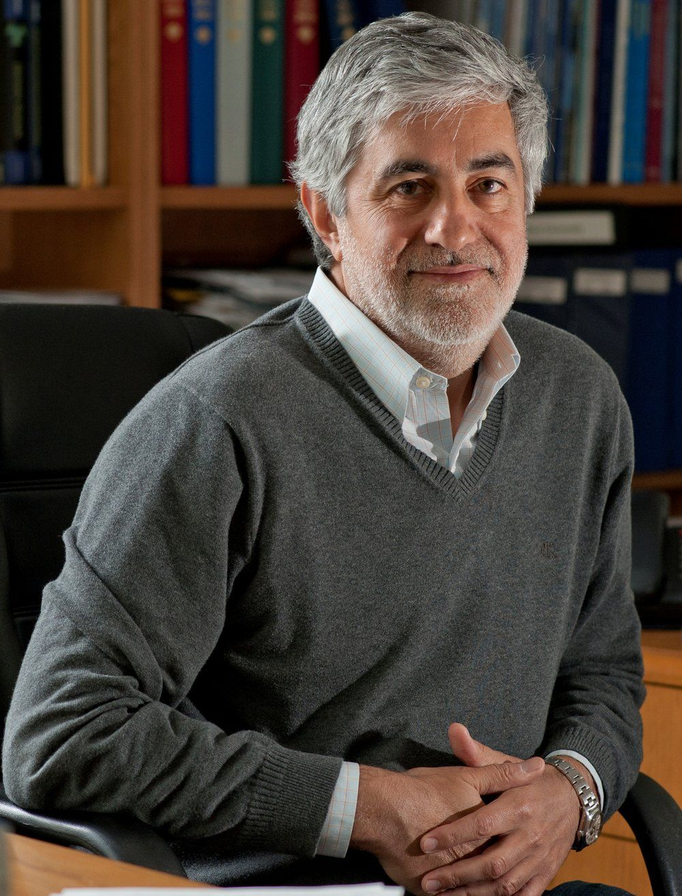

MQM 2022 follows a long and distinguished tradition of conferences dedicated to honoring the achievements of leading scientists in the field and highlighting the superb science of the international quantum chemistry community. MQM 2022 in the U.S. will honor the work of Prof. Martin-Head-Gordon and Prof. Gustavo Scuseria.

	

		

			
		

		

			
		

	

	

		

			<em>Prof. Martin Head-Gordon 
			University of California, Berkeley</em>
		

		

			<em>Prof. Gustavo Scuseria   Rice University</em>
		

	
	
	

		

			<ul>
				<li>1989, Athens, Georgia: In Honor of John Pople (1998 Nobel Prize)</li>
				<li>1995, Cambridge, England: In Memory of Samuel Francis Boys and in Honor of Isaiah Shavitt</li>
				<li>2001, Seattle, Washington: In Honor of Ernest R. Davidson</li>
				<li>2004, Cambridge, England: In Honor of Nicholas C. Handy</li>
				<li>2007, Budapest, Hungary: In Honor of Peter Pulay</li>
			</ul>
		

		

			<ul>
				<li>2010, Berkeley, California: In Honor of Henry F. Schaefer</li>
				<li>2013, Lugano, Switzerland: In Honor of Rodney J. Bartlett</li>
				<li>2016, Uppsala, Sweden: In Memory of Jan Almlöf, Inga Fischer-Hjalmars, Per-Olov Löwdin, and Björn Roos, and in Honor of Per Siegbahn</li>
				<li>2019, Heidelberg, Germany: In Memory of Reinhart Ahlrichs and In Honor of Werner Kutzelnigg, Wilfried Meyer, and Sigrid Peyerimhoff</li>
			</ul>
		

	

