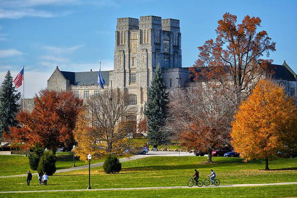

	
  

    Registration for MQM is now open
  

  

    <!-- <h5 class="card-title">Registration for MQM is now open</h5> -->
    
Register by *** to take advantage of early fee starting at $200

    <a href="https://register.cpe.vt.edu/search/publicCourseSearchDetails.do?method=load&courseId=4623658" target="_blank" class="btn btn-outline-danger">Register Now</a>
  

 
 

#### Refund and Cancellation Policy

Refund requests must be received 14 calendar days prior to the program start date. A $30 administrative fee will be deducted from all refunds. Requests should be sent by email or by initiating a drop request through the student portal in our online registration system. As an alternative to a refund, you may send a substitute at no additional cost. Please contact us at 540-231-5182 or e-mail cpeinfo@vt.edu to request a substitution. Please note: refunds will not be issued for no-shows or for cancellations received on or after the program start date. 

In the unlikely event that this program is cancelled or postponed due to insufficient enrollments or unforeseen circumstances, the university will fully refund registration fees but cannot be held responsible for any other expenses, including cancellation or change charges assessed by airlines, hotels, travel agencies, or other organizations.